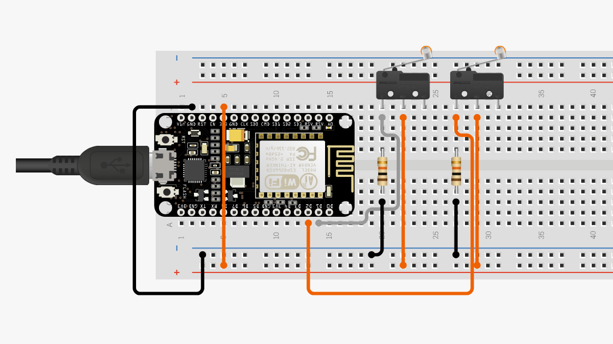
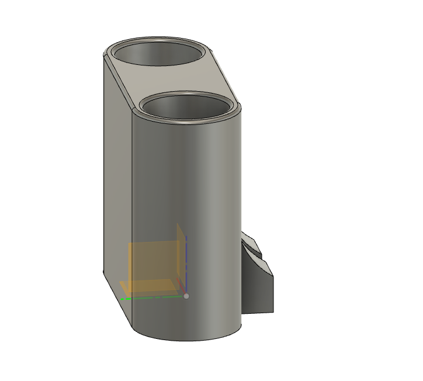

# SmartToothBrushHolder
MQTT Smart Tooth Brush Holder for Easy Integration with Home Assistant.

## How It works

2 Limit Switches in are at the bottom of each tooth brush slot, when the tooth brush is removed the switches open.
the ESP reads this transition after 5 seconds and fires an event to MQTT.

## BOM

ESP8266 - https://www.amazon.com/gp/product/B07HF44GBT/ref=ppx_yo_dt_b_asin_title_o02_s00?ie=UTF8&psc=1
Micro Limit Switch - https://www.amazon.com/gp/product/B088W8WMTB/ref=ppx_yo_dt_b_asin_title_o03_s00?ie=UTF8&psc=1
2 10k Resistors

## Circuit 

Ciruito.io shows the circuit and you can buy all the parts you need here
https://www.circuito.io/static/reply/index.html?solutionId=6057efa760f67a00305f1fa2&solutionPath=storage.circuito.io

## 3D Model
Sample 3D Model holds kids battry operated tooth brushes, not all tooth brushes will trigger the limit switches

both STL and Fusion 360 files can be found in the models folder

## ESP Source Code

Firmeware must be updated with WIFI SSID/PASSWORD and MQTT information before flashing, flashing can be done with Arduino IDE

## TODO
- Add Home Assistant Configuration Settings
- Add Support for Other Tooth Brush Sizes